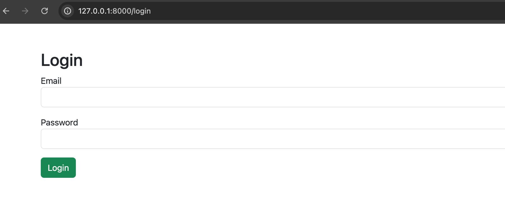
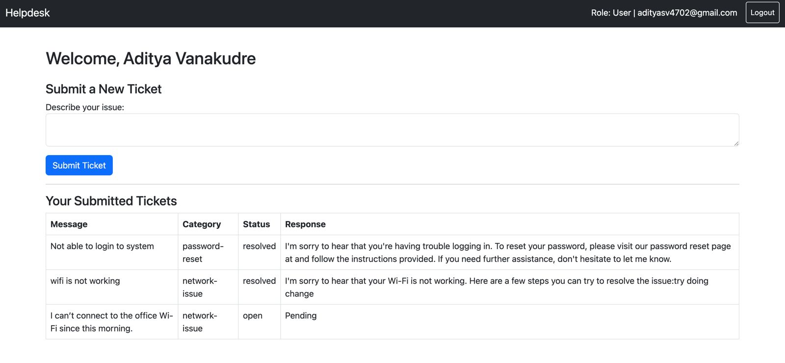
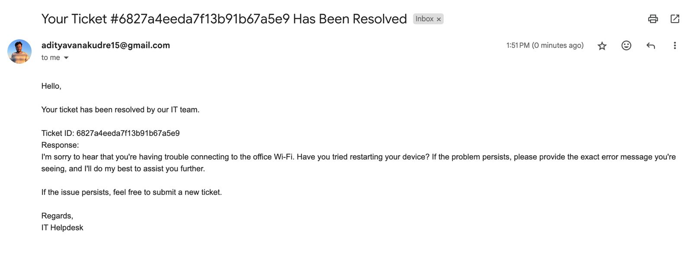
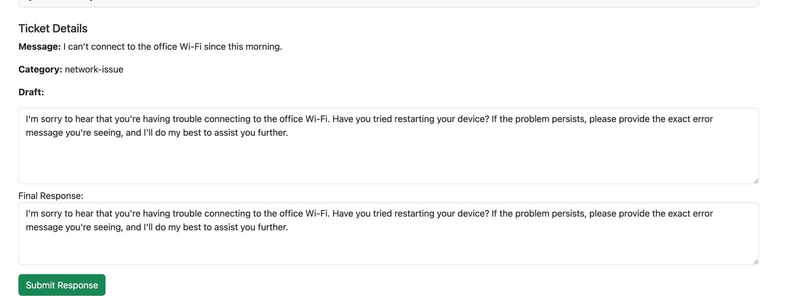

# LLM-Powered IT Helpdesk System

This is a full-stack intelligent IT helpdesk solution that uses a Large Language Model (LLM) to assist in automating ticket classification, drafting responses, and resolving issues efficiently.

---

## 🚀 Features

### 👤 Users
- Register and login
- Submit new tickets describing technical issues
- View submitted ticket history
- Get email notifications on:
  - Ticket creation
  - Ticket resolution

### 👨‍💻 IT Team
- Login as IT support personnel
- View and filter all open tickets
- Review or edit AI-generated responses
- Resolve tickets and notify users by email

---

## 🤖 LLM Integration

The system uses the `Mixtral-8x7B-Instruct` model via Hugging Face's inference API to:
- Classify tickets into categories:
  - `network-issue`, `password-reset`, `hardware-issue`, `software-bug`, etc.
- Generate a helpful draft response which IT staff can review and submit.

---

## 🧪 Sample Inputs

| Message | Expected Category |
|--------|-------------------|
| “I can’t connect to Wi-Fi at the office” | `network-issue` |
| “Forgot my login password” | `password-reset` |
| “Need access to payroll dashboard” | `access-request` |
| “Outlook crashes when I open emails” | `software-bug` |
| “Monitor is not turning on” | `hardware-issue` |

---

## 🖼️ Screenshots

### 1. Login / Register


### 2. User Dashboard - Create Ticket


### 3. Ticket Confirmation Email


### 4. IT Dashboard


### 5. Resolution Email


---

## ⚙️ Setup Instructions

### 🔹 Backend (Flask + MongoDB)

1. Make sure MongoDB is running (e.g., via Docker)
2. Run the backend:
```bash
python app.py
```
> Runs at `http://127.0.0.1:5000`

### 🔹 Frontend (Flask with HTML + Bootstrap)

```bash
cd frontend
python app.py
```
> Runs at `http://127.0.0.1:8000`

---

## 📨 Email Integration

Emails are sent using Gmail SMTP:
- On ticket creation (confirmation)
- On ticket resolution (final response)

Configured via:
```python
EMAIL_ADDRESS = "your-email@gmail.com"
EMAIL_PASSWORD = "your-app-password"
```

---


